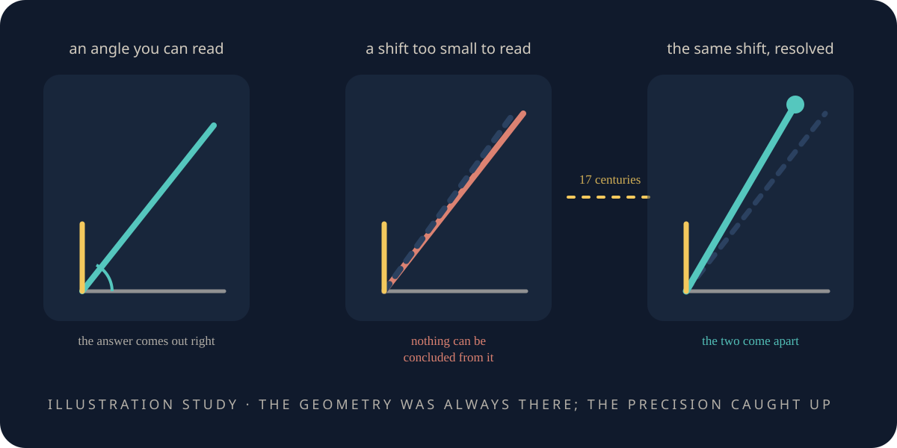

# A few thousand years of sharper shadows

> **Scope.** This chapter is history — real measurements of the real world, by people whose names we
> know. It is here for one habit that carries into everything after it, in a book about a **toy**: say
> how well you can see, and let a finer instrument overturn you.

<figure class="chapter-illustration">
  
  <figcaption><strong>Analogy — not data.</strong> The same geometry three times over, and the middle and right panels are the same measurement. What changes between them is not the reasoning but how finely the angle can be read — which is the whole of this chapter.</figcaption>
</figure>

<!-- beat 93 -->

You have just watched an instrument refuse a law its owners committed to. That is not a modern
virtue; it is the oldest habit in measurement, and there is a two-thousand-year case study.

Eratosthenes sized the Earth with two posts and one multiplication. The obvious next question is how
far away the Sun is — asked immediately, and unanswered for another two thousand years.

Why?

## Not for lack of the idea

<!-- beat 93 -->

That is the useful part, so it is worth being precise: **it was not for lack of the idea.**

Aristarchus of Samos, a generation earlier, had the method right. At half moon the Sun, the Moon and
the Earth stand at a right angle — you can see it in the shape of the lit half. Measure the *other*
angle, at the Earth between the Moon and the Sun, and the triangle is fixed: two angles and the side
between them give how much further the Sun is than the Moon.

That is triangulation, and he had it. So how did it give the wrong answer?

## The right method, the wrong answer

<!-- beat 94 -->

Aristarchus measured that angle at about 87 degrees, and concluded the Sun was around twenty times
further away than the Moon.

It is about four hundred times further.

The error is not where you would guess. The true angle is about 89.85 degrees —
**nine minutes of arc short of a right angle**, less than a third of the Sun's own width in the sky.
Aristarchus read it as three degrees short. Nine arcminutes is far below what anyone could read off
an instrument of wood and sightlines, and the whole answer hangs on it: push the angle a hair closer
to 90 and the distance runs off toward infinity, back it off and the Sun comes far too close.

So: right method, wrong answer, and the fault is in neither the geometry nor the man.
**The fault is in the resolution.**

Which is a distinction worth having a name for.

## Being wrong, and being unable to see yet

<!-- beat 95 -->

They are not the same thing, and almost everything in this chapter turns on the gap between them.

Notice how much *did* work with sticks and shadows. Within a century, Hipparchus of Nicaea used the
Earth's own shadow — the bite it takes out of the Moon in an eclipse — to get the Moon's distance.
That answer was very nearly right, and has stayed so.

Same era, same tools, same geometry: one lands and the other cannot. What decides it is whether the
quantity sits on a knife edge, where the smallest misreading is amplified into a factor of twenty.
Hipparchus' did not. Aristarchus' did.

Which brings us to the most expensive mistake in the chapter.

## The null that was read as an absence

<!-- beat 96 -->

Three centuries later, the question was what to make of a measurement that kept coming back empty.

If the Earth moves around the Sun, a nearby star should shift against the far ones as we swing from
one side of our orbit to the other — the way a near tree shifts against a distant hill when you move
your head. Nobody could see it.

That nothing meant one of two things: the Earth does not move, or the stars are so far away that the
shift is too small to see. Both readings were available at the time, and the one that won held for
well over a thousand years.

## Two readings, and the one that held

<!-- beat 96 -->

Aristarchus had proposed a moving Earth, and Archimedes records the enormous sphere of fixed stars
that came with it. It was **Aristotle**, in *On the Heavens*, who argued the other way from the
missing shift itself: no shift, therefore no motion. Ptolemy's *Almagest*, around 150 CE, came down
the same way for reasons of its own, and that is the version that carried.

The observation was fine and the null was real. What went wrong was the *interpretation of a null* —
treating "I cannot see it" as "it is not there", rather than "it is smaller than I can resolve, and
here is how small that is."

A null result is not an absence of information. It is a bound, and a bound is only worth anything if
you say how tight it is.

So what finally moved?

## The instrument, not the idea

<!-- beat 97 -->

Not the reasoning. Nobody improved on the triangle.

What arrived was instruments — a telescope, then better ones, then clocks good enough to carry a
time across an ocean. The unanswerable questions began falling, in order of the precision needed.

**That light takes time to travel** — Ole Rømer, 1676 — from Jupiter's moon Io slipping out of
schedule depending on where the Earth was. Rømer put the slippage at about twenty-two minutes across
our orbit; it is nearer seventeen. He gave the delay, not a speed; Christiaan Huygens turned it into
one, and because the delay was long the speed came out about a quarter low — honestly out, by a
knowable amount.

## And then the Sun, and then the star

<!-- beat 97 -->

**The distance to the Sun**, at last, in the 1760s — not by measuring that impossible angle but by
sidestepping it, in a scheme Edmond Halley set out decades before anyone could use it: watch Venus
cross the face of the Sun from two places far apart, and time the crossings. It took telescopes,
tables good enough to find longitude at sea, and expeditions — Cook to Tahiti in 1769, others to
Siberia and northern Norway.

**The distance to a star** — Friedrich Bessel, 1838 — and with it the answer to that ancient null,
seventeen centuries late, and the first stellar parallax anyone believed. For 61 Cygni the shift is
about a third of a second of arc — a coin at fifteen kilometres. The stars had never been still.
They had been outside the resolution.

Which is exactly the shape of something in our own record.

## The first: a number already in the record

<!-- beat 98 -->

Two measurements here had been recorded as misses — quantities outside their registered bands. They
sat in the record as failures for a long time, and this book would have reported them so.

Both were later dissolved, and it is tempting to say they went the same way. They did not.

Both quantities are measured *from* a critical point — where the little world changes character —
and that point is only located to within a margin. Neither miss was a fact about the little world;
both were that margin, never carried into the number depending on it. What differs is what it took
to carry it through.

The first miss needed nothing new at all. The rung that recorded it had published its own locator
margin, and had measured how far the quantity swings when the location moves. Multiply the two and
the uncertainty comes to about eighty per cent of the band the rung registered. At all three
candidate locations the miss then falls inside the margin the rung registered to judge it by —
comfortably at only one. That is what *dissolves* means here, and the rung says so of itself: the
miss is no longer significant, not the value confirmed.

No new estimator, no new run — two numbers already on the page, multiplied by somebody who thought
to.

## The one that needed a better instrument

<!-- beat 98 -->

The second was not like that, and calling it the same would be flattering ourselves.

Its own published numbers do not dissolve it. Closing it took a *new* estimator — written for the
next rung, for another purpose — and an error bar that did not exist until the re-analysis added it.
With those the miss closes to within one standard deviation; without them it stands at about five.

And notice what it did *not* take: no new measurement. The curves it re-read were the failing rung's
own. The observation had been sufficient all along; what nobody had written down was the way to read
it.

And it still rests on a choice. There are two defensible ways to aggregate the curves it fits, and
**they give opposite verdicts**. What licenses the choice is a case where the answer is
independently known — a real argument, and not the same as not having to choose. The next rung says
outright that it does not generalise.

One miss dissolved into arithmetic already published; the other into an instrument that had to be
built.

## The star that was never fixed, twice over

<!-- beat 99 -->

Now put them against Ptolemy, because there turn out to be three ways this can go and he is only one
of them.

**Ptolemy could not have done better.** He looked with the instrument he had, recorded honestly that
there was nothing to see, and the record stood until a finer one found the shift. Nothing available
to him was left unused.

**Our first is the opposite, and the uncomfortable one.** The number that dissolved it was already
in the record, correct, and never multiplied through. The resolution was there and we had not used
it.

**Our second is neither.** The measurement was good enough; the way to read it had not been written.
Not a telescope we lacked, not arithmetic we skipped — a method nobody had invented, applied
afterwards to data that had been waiting.

## Why the rows stay, and what it cost to find them

<!-- beat 99 -->

Which is why the original rows are still there, not deleted and rewritten, carrying a note of what
later work found — so the miss is still there to read. Both re-analyses are rungs of their own,
named in the appendix.

And it is why this is the rarest thing an instrument can do. Recovering a known answer is
calibration; an unknown one is a result; refusing a law you proposed is discipline. Going back to a
published failure and finding it was the reading rather than the world — the number unused, or the
method unwritten — cannot be arranged in advance.

There is one step left, and it does not belong to us.

*What this chapter cites — and what it does not:
[the simulations](the-simulations.md#s-a-few-thousand-years-of-sharper-shadows).*

**Next:** [Cast your own shadow](cast-your-own-shadow.md)—the part where you stop reading and check
one of these results yourself.