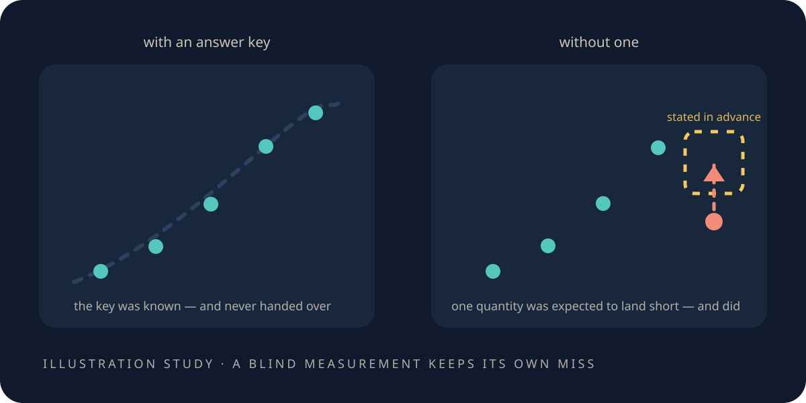

# Can it tell me something I didn't tell it?

> **Scope.** *Ising model*, *critical point* and *universality* name lattice models and the
> dimensionless properties they share with some measured systems. This is a **toy**; agreement with a
> universality class says nothing about spacetime.

<figure class="chapter-illustration">
  
  <figcaption><strong>Analogy — not data.</strong> An instrument earns trust on a case whose answer is known, then works where no answer exists — and keeps the one shortfall it predicted for itself. The numbers are in the figures linked below.</figcaption>
</figure>

<!-- beat 89 -->

You now have something that can find a law it was not told. The obvious thing to do with it is point
it somewhere nobody knows the answer — and the obvious thing is where toys go wrong.

So start with the failure mode, because it is seductive and this project used to do it.

There is a way to make a toy look profound. You take a famous constant of nature. You build formulas
out of whatever your model happens to contain — counts of faces, powers of π, small integers — and
you keep going until one of them lands close. Then you write it up.

It always works, and it never means anything. A target whose value you already know will attract
formulas indefinitely; closeness is not evidence when you were free to keep searching. The search
had no way to fail.

So what would count instead?

## What would count

<!-- beat 90 -->

Three properties, and the third is the one that does the work.

You need a number **the method was not built to know** — not a target it was aimed at. You need
**no dial available to tune it** toward the answer, because a knob that can reach the right answer
will be turned until it does, honestly and unconsciously. And you need to be
**unable to check it until after you have committed**, so that the commitment is real.

That is a demanding list. Notice it rules out almost everything a small model can say about a big
world. Where would you even find such a number?

## Where nature hands you one

<!-- beat 91 -->

At the edges where things stop being one thing and become another.

When a magnet is on the verge of losing its magnetism, or a fluid is approaching the ridge where
liquid and gas stop being different substances, something strange happens: the microscopic details
stop mattering. Systems made of completely different stuff — different atoms, different forces,
different everything — begin behaving identically in the ways that count. The numbers describing
*how* they behave near that edge come out the same.

That is universality, and it is one of the better facts in physics.

For a toy it is a gift, because our little world does not have to pretend to be a real magnet. It
only has to belong to the same class. And class membership is decided by a handful of dimensionless
numbers that have been measured independently, in laboratories, on actual matter — numbers nobody
had to tell us.

Before we point the instrument at one, though, commit to something.

## ✎ Before we look

<!-- beat 92 -->

**Write down your answer.** Would you trust an instrument's report about a case nobody has solved,
before you had seen it recover a case somebody has?

It is worth answering honestly rather than correctly, because the interesting version of the
question is *how much* would you trust it, and what exactly would the known case have to get right
first. Write down the standard you would want met. One line.

## Make the instrument earn it

<!-- beat 93 -->

We used a two-dimensional case that has an exact solution — Lars Onsager's, from 1944, one of the
results that made universality believable in the first place.

The answers are known precisely, and they were not given to the machinery. The pipeline saw only its
own runs at a handful of manageable sizes, and had to produce the class numbers itself.

It got them: two of the three to seven digits, the third to four.

That is not a discovery. It is a calibration, and it is the whole reason anything later in this
chapter is worth reading. An instrument that cannot recover a known answer has no business reporting
an unknown one.

**[Open the data-true universality figure](record/lab/warp-5-universality/0500-ising-universality/figures/universality.html)**

Now take the answer key away.

## The case nobody has solved

<!-- beat 94 -->

The three-dimensional version of the same model has no closed-form solution. Nobody has one. It is
not that it is hard to look up — it does not exist.

The pipeline ran there unchanged. It reproduced the solved two-dimensional numbers first, as a
built-in check, then went to three dimensions and reported what it found.

Two exponents, agreeing with the values measured *in real matter* — at the liquid–gas critical
point, and in uniaxial magnets — to within a few percent. Nobody fitted those targets. There was no
parameter in which they could have entered.

That is the thing worth wanting from a lattice: not a formula that lands near a famous number, but a
computation that produces a number nobody supplied, which then agrees with measurement.

It was still handed two things, though, and they belong in the same breath.

## Take the ingredients away too

<!-- beat 95 -->

The two things were the temperature at which the transition happens, and one of the class numbers
itself. So the agreement above is real, and it rests on two ingredients it was given rather than
found.

A later run removed both. It found the critical point itself, from where its own curves at different
sizes cross, and measured the rest from scratch — the fully blind version, with nothing supplied but
the model.

It found the critical temperature to within about four parts in ten thousand of the published value.

Which is the strongest result in the book, and it is also the moment to ask the question a sceptic
asks about a strong result: did it miss anything?

## The miss it called in advance

<!-- beat 96 -->

It did. One quantity, and it came out too high.

Here is the part worth slowing down for. Before the run, the team wrote down that this particular
quantity was the one the affordable lattice sizes could not pin down — and that its estimate would
come out *too high*, in that direction, for that reason.

It came out too high.

The band it registered for that quantity was 0.63 to 0.80, chosen in advance to sit high of the
class value precisely because the affordable sizes could not do better; it landed inside, high, as
written.

An experiment that announces its own ceiling in advance is doing something different from one that
explains a shortfall afterwards. The first is a prediction the experiment made about itself and then
met; the second is a story assembled once the answer was in.

So the instrument can recover a known answer, work where no answer exists, and state its own limits
and hit them. What is left for it to prove?

## The one thing left

<!-- beat 97 -->

That it can tell us we were wrong.

Everything so far has been the instrument agreeing — with Onsager, with real matter, with its own
registered expectations. Agreement is cheap in exactly the way the formula-hunting was cheap: a
method with no way to fail produces agreement whether or not it is measuring anything.

So the test that matters is the opposite one. Give it a law we are confident about, one we would
defend, and see whether it has the standing to refuse.

*What this chapter cites — and what it does not:
[the simulations](the-simulations.md#s-a-number-without-the-answer-key).*

**Next:** [When the world you built says no](when-the-expected-law-fails.md)—the obvious answer,
refused.