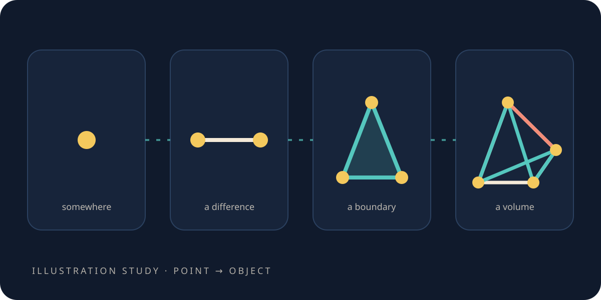

# Build the object

> **Scope.** Every point, line, patch and ripple in this chapter belongs to a **toy** — a structure we
> built, not a description of space. The construction is exact inside the toy. It is not evidence that
> physical space is discrete, and the object we end up with is a choice, not a discovery.

<figure class="chapter-illustration">
  
  <figcaption><strong>Analogy — not data.</strong> Each step exists only because the one before it left a hole. The counts and angles the finished object actually has are in the appendix.</figcaption>
</figure>

Most explanations of a simulation begin in the middle. *Here is the mesh, here is the equation, here
is the result.* That is efficient if you already know why the mesh has the shape it does. For
everyone else it turns the most important decision in the whole project into scenery.

So we will build it instead. Each step below exists because the step before it left something
missing, and the object itself does not appear until near the end — because it is the *answer* to a
question, and answers are worth less when you meet them before the question.

## Somewhere to put a number

The mathematics physics is written in assumes you can always look closer. Between any two points
there are infinitely many more, and between any two of those, infinitely many more again.

No measurement has ever seen that. Every measurement anyone has ever made is a finite list of
numbers. Whether space itself is like the mathematics is an old, open, genuinely interesting
question — and we do not need the answer, which is a relief, because we are not going to get one.

So do not start from a smooth world and chop it up. Start from nothing and ask what the least is.

You need somewhere to put a number. Call it a **point**.

## Somewhere to put change

One number sitting still is not physics. Physics is mostly about *difference* — this is warmer than
that, this is higher than that, this is later than that.

And a difference is never *at* a place. It is *between* two places. So it needs its own home: the
**line** joining them.

A point and a line. That is the starting kit, and it is worth pausing on how little it is. There is
no distance yet. No direction. No time. Nothing but places, and connections between places.

And here is the thing worth holding on to: **that is not a crude version of something better.** It
is a small world, complete in itself, and everything we do on it will be exact. When a textbook
formula turns up later in these pages, it turns up as a *comparison* — never as the standard this
little world is failing to meet.

## Walk in a circle and come back

Now something surprising, and it costs nothing.

Take a loop of lines. Start at a point, walk around the loop adding up the differences as you go,
and come back to where you began. What must the total be?

Zero. It has to be — you are back at the number you started from.

Not *nearly* zero. Zero. The differences carry plus and minus signs depending on which way each line
points, so they cancel the way integers cancel, not the way careful measurements almost cancel.

This is the reason a machine built this way can be trusted before any physics goes into it. Most
simulation error is the slow decay of something that was only ever approximately true: it holds at
this resolution, in these units, for this many steps, and then it quietly stops. Here the
cancellation is a fact about counting. It holds at any size, in any units, however long you run — or
the thing you built is not a mesh at all.

And you do not have to take that on argument. Walk every loop in the object, add the totals up, and
they come back zero — exactly zero, as integers, at any size.

## Nothing yet knows how long a line is

Read the last section again and notice what was never used: **length**.

No line has one. You cannot say which of two lines is longer. There is no angle, no area, no volume,
no speed — and the loop result does not care, because it never asked.

That is not a gap to fill in later. It is *why* the result is exact. Counting and direction were all
it consumed, so nothing about the shape of anything can make it wrong. Size will have to come from
somewhere else, and keeping it somewhere else is the entire design.

## Make time, and add exactly one rule

Everything so far is a still photograph. So add a clock: ticks, all the same.

And add one rule for what a tick does.

> At each tick, every point adjusts its own number towards its neighbours' — by an amount the
> differences on its lines tell it — and carries forward the change it has built up so far.

That sentence is the whole law. Nothing is ever added to it. No forces, no particles, no extra
equation bolted on later when something needs explaining. Every result in the rest of this book is
that one rule, run.

## The rule makes ripples

Start everything at rest. Poke one point — lift its number, then let go.

Its neighbours notice, because the differences on their lines just changed. Their neighbours notice
on the next tick. What you get is a ring, spreading outward, exactly like a stone dropped in a pond.

Nobody wrote "wave" anywhere. There is no wave in the rule; the rule is one sentence about
neighbours. **The ring is what that sentence does** — and that is the pattern for everything ahead.
We never tell the little world what to produce. We tell it how neighbours settle, and the behaviour
is the consequence.

Which raises the first real question in this whole project, and it is the kind a stopwatch asks:
*how fast is that ring travelling, and is it the same speed in every direction?*

## "How fast" needs "how far"

Speed is distance over time. The time half is easy — it is ticks, and every tick is the same.

The distance half we do not have. Three sections ago that was a virtue.

Counting steps does not rescue it. A step along the edge of a cube and a step across its diagonal
are both *one step*, and nothing anywhere in the structure says otherwise. If they genuinely do not
differ, then "how fast" has no answer — only "how many steps", which is a different question, and
not one a stopwatch can settle.

So sizes have to be written in somewhere. Length is not something this object *has*. It is something
we must **give** it — through exactly one place, because the two results above hold precisely
*because* nothing else knows about it.

We come back to that single place shortly, and it turns out to be a dial you can watch being turned.
First there is a choice still to make.

## Which points, then, and which lines?

Everything so far holds for *any* arrangement. Now the choice.

Squares look like the obvious building block and they are the wrong one. Pin the four corners of a
square and it can still flex — it leans over into a diamond without any corner leaving its pin,
because nothing fixes the diagonals. A triangle cannot do that. Fix three corners and the triangle
is finished. It is the smallest patch that holds its own shape, and one step up, the tetrahedron is
rigid for the same reason.

So: tetrahedra. Except for one old surprise.

**Regular tetrahedra do not fill space.** Aristotle wrote that they do, and the mistake stood for
something like eighteen centuries. Stack them around a shared edge and they come very close to
closing, and *very close* is the whole story: five of them leave a thin wedge that no sixth can
fill. The angle is in the appendix, measured on the tetrahedron itself rather than remembered from a
table.

Which means there is no perfect answer, and **every tetrahedral lattice is a compromise.** That
matters more than it sounds. A compromise is a *choice*, a choice has consequences, and the
consequences can be measured.

Here is the choice we made. Take the eight corners of a cube and sort them into two groups by
whether their coordinates add up to an even or an odd number. Each group of four spans a regular
tetrahedron. The two tetrahedra pass through each other and never share an edge. Tile that, and the
wedge from above shows up honestly, as gaps between the tetrahedra — filled in their turn, each
split into four more.

The two families are mirror images. So handedness is not a feature we added later; it is present in
the object before a single number is stored on it, which is why it keeps coming up.

That is the object. Everything from here is this one thing, asked a different question.

*The simulations behind this chapter: [the simulations](the-simulations.md#s-build-the-object).*

**Next:** [The round ripple](the-round-ripple.md)—we give the object a sense of size, and watch what
happens to the ring when we get it wrong.