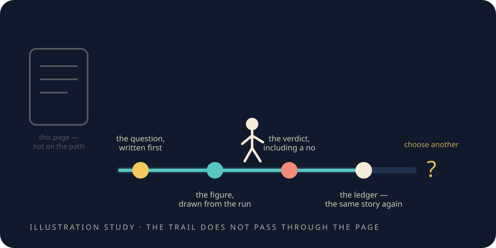

# Cast your own shadow

> **Scope.** The checks below inspect a computational-physics **toy** and the repository that holds
> its record. A reproducible toy result is still a toy result: reproducibility is evidence about what
> the code did, not about anything outside the firewall.

<figure class="chapter-illustration">
  
  <figcaption><strong>Analogy — not data.</strong> Every stop on that walk is a file in the repository. This page is not one of them — the trail runs through the record rather than through the book.</figcaption>
</figure>

The manuscript this edition grew out of ended in celebration: *we measured our bubble together.*

I would like to keep the warmth of that and fix the claim.

We did not measure the universe. We inspected one object we had built, and we watched its measuring
tools do seven things: recover laws that were already known, tell controls apart from results, produce
a number nobody supplied, state a limit in advance and then hit it, keep the negatives in the record at
full size, find that two published failures had been our own analysis rather than the world — and
refuse a law we proposed ourselves.

That is a smaller claim than a theory of everything. It is also considerably more useful, because it
is the kind of claim that could have come out false, and you can go and check whether it did.

## Follow one result without running anything

Take the refusal from the last chapter — the exponent that came out a little over half the expected steepness.
Four files, ten minutes, no build required.

1. **Read the question before you know the answer.** Open that experiment's
   [`spec.md`](record/lab/dna-thz/0001-dna-permittivity-shift-law/spec.md). Find the expected
   exponent and the band that was going to decide it. Notice the date on it.
2. **Look at the data.** Open the
   [data-true figure](record/lab/dna-thz/0001-dna-permittivity-shift-law/figures/shift_law.html) and
   compare the measured line against the rejected square root. The picture is drawn from the run's own
   output; there is no illustration in it.
3. **Read the verdict.** Open
   [`eval.md`](record/lab/dna-thz/0001-dna-permittivity-shift-law/eval.md) and check whether the
   negative appears in the conclusion — or whether it has been softened into a partial success on the
   way to the summary.
4. **Check the summary tells the same story.** Find the same result in
   [`PREDICTIONS.md`](record/PREDICTIONS.md). The public page, the chapter you just read, and the
   project's own ledger should agree. If they do not, the chapter is the thing that is wrong.

That walk tests something narrow and important: that the order was question, then data, then verdict,
then summary — and not the other order, which is how most disappointing results become encouraging
ones.

## Check this edition against the record

The chapters you have read carry no rung labels and no quotations. That is a deliberate choice. That
provenance did not go missing. It moved to the appendix.

Clone the book — `github.com/zacharyelston/OurBubble` — and run these from its root. Everything the
book quotes travels with it, in `record/`: the registered experiments, their verdicts, the tests, the
figures, copied out of the engine at the one commit `record.lock` names. So none of this needs access
to anything but the clone you just made. The second command needs
[mdBook](https://rust-lang.github.io/mdBook/) installed; the others need only Python.

```sh
python3 check_edition.py
mdbook build
python3 check_edition.py --rendered
```

The first command is the book reading itself, and it is worth being exact about what it promises.

**Every figure with a `read from` file beside it in the appendix is checked verbatim** against that
file — those, and only those, are the ones a program has been over. **Every figure a chapter sets in
digits and puts in bold is checked too**: it has to be one its own appendix section declares that way,
so a number cannot be emphasised into your eye without a counterpart in the record. Alongside that, it
confirms each cited test and figure is still in the repository, each chapter still points at its own
section, and each chapter still carries its visible scope statement.

It also holds the whole edition against **the list of retired claims** — the constant-formulas and
structural correspondences this project's older phase went in for, which chapter one mentions. If any
of them reappear, in a chapter or in the appendix, in any wording it recognises, the book is refused.
That guard is itself tested on every run against sentences it is required to refuse, so it cannot
quietly stop working.

**Everything else is prose, including some of the appendix.** When a chapter says the energy at the
wall is a few hundred times what sits in the calm middle, or that a signal arrives about half a million
times weaker, no program has read that sentence — the second one is bold, but it is bold *words*, so
the digit rule never sees it. Those are numbers we wrote, from runs whose figures are linked and whose
experiments the appendix names.

The history chapter's figures are outside it too, and differently: no file is named beside `89.85°` or
`~0.3 arcseconds` because none of it is ours. **Those are the numbers in this book you can check
against the world instead of against us** — which is a better guarantee than the one a program can
give. Knowing exactly where each line falls seems more use to you than a larger claim would be.

The second command builds the book — and building it **regenerates the appendix from the record**, so
the page you read is assembled rather than maintained. If the record has moved, the file changes under
you and `git status` says so. The third command reads the pages the build produced and follows every
link in them, which is the only way to catch a link that works in the source and breaks once
rendered.

None of that computes any physics. It checks that the story and the record still say the same thing.

## The check that would actually catch us

The commands above verify bookkeeping. Here is the one that verifies the science, and it is the reason
this project can make the claims it does.

Pick a result. Re-run its test — the real one, at full size, and let it **overwrite the committed data
this book quotes**. Then ask git whether anything changed.

Nothing should change. If any number in these chapters had been nudged after the fact, tuned to taste,
or typed in by hand, that is where it appears.

Every appendix section carries the command for its own result. Start with one whose runtime suits your
machine, read what the section says about it first, and — this is the part that makes it an experiment rather than
a chore — **write down what you expect before you press Return.**

If the regenerated files do differ, do not explain it away. Stop and find it. A changed seed, a changed
dependency, a changed tolerance, a changed piece of machinery: each of those is part of the result's
history and worth more than the result.

## What we carry out of the bubble

The shadow was never proof of a sphere. It was an invitation to build a test.

The ripple was not light. It exposed a directional bias, and the one setting that removed it. The
shaped push was not a drive; it located a sign and the classical obstruction standing in front of it.
The wall genuinely isolated and genuinely did not change inertia. The attempt to empty a volume failed. The vacuum
recovered a known law without being told it. Universality gave up its answer key and kept its limits.
The material bridge refused the easy exponent.

Put together, those do not add up to a discovery. They add up to a method:

1. Notice something you cannot explain.
2. Propose the smallest structure that would explain it.
3. Say, in advance, what would prove the proposal wrong.
4. Check — and keep the answer, especially when it is no.

The container is the object we examined. The bubble was the shared view we had while examining it.
Neither of them asks for belief, and this book has tried hard not to either.

So go and find another shadow. Then write down what it would take to surprise you — before you look.

*What this chapter cites — and what it does not: [the simulations](the-simulations.md#s-cast-your-own-shadow).*
