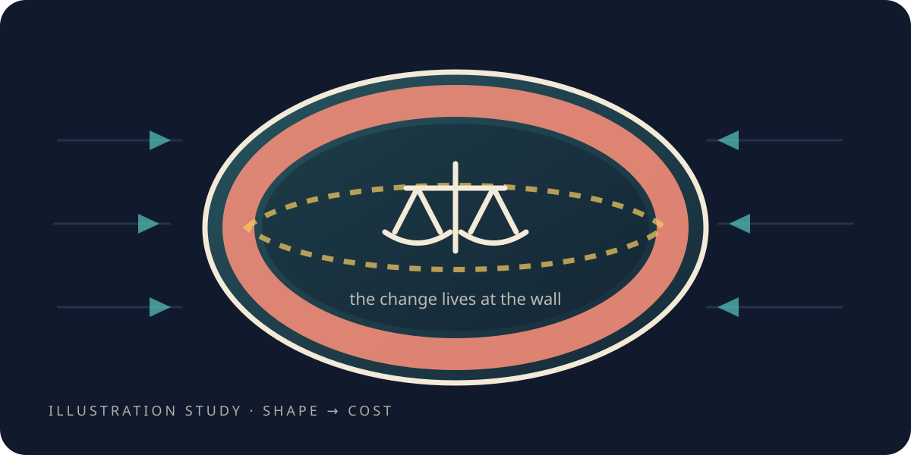

# What does pushing on it cost?

> **Scope.** The "bubble" here is a shaped region inside a **toy** computation, and its "energy" is a
> number a formula returns about that shape. Nothing here is a spacetime, a propulsion system, or a
> claim that any of this could be built. Negative in this chapter means *below a baseline*, not a
> supply of anything.

<figure class="chapter-illustration">
  
  <figcaption><strong>Analogy — not data.</strong> The interesting question about a shaped change is not how large the cost is but where it sits. The measured answer is in the figure linked below.</figcaption>
</figure>

<!-- beat 53 -->

The world now behaves the same way in every direction, which means a measurement made in it means
what it appears to mean. So here is the next thing you can ask of such a world.

What would it cost to move a *piece* of it?

Not to move something through it — that is just a ripple, and you have seen one. To take a region,
contents and all, and shift the region itself along. Call the region a bubble; that is all the word
means in this book, and it is the only thing it means.

Before spending anything on a shaped one, though, there is a cheaper question worth guessing at.

## ✎ Before we look

<!-- beat 54 -->

Forget shaping for a moment. Push the *whole* world: take every dot in it and shift it by the same
amount, in the same direction, all together.

**Write down what you think that should cost.**

Take the guess seriously for a second, because it is not a trick. There is an argument that it
should cost a great deal — you have moved everything there is. There is an argument that it should
cost nothing at all. Decide which, and write down why in half a sentence.

## The bill for moving everything

<!-- beat 55 -->

Nothing. And you can see why once you have said it out loud: shifting every dot by the same amount
is not an event. Nothing in the world has changed relative to anything else in the world. All you
have done is renumber where things are — the same arrangement, described from one pace to the left.

So the honest expectation is a bill of zero, and the reason to run it anyway is that our formula
does not know any of the above. It just takes a configuration and returns a number.

It returned exactly zero. Not nearly zero, not zero to within the arithmetic — zero, with nothing
left over.

That is the most boring result in this chapter, and it is the one that licenses every result after
it. Because the uniform push is free, whatever we get charged next is being charged for the
*shaping*, and not for having a grid, or a boundary, or a floating-point number. Without this beat,
every number that follows could be the machinery talking.

Now shape it.

## Shape the push

<!-- beat 56 -->

Make the push non-uniform: strong inside a region, fading to nothing outside it, with a transition
between the two. That transition is the wall of the bubble.

This is the point to say what we were watching for, because it is the difference between a
measurement and an anecdote. Miguel Alcubierre wrote down, in 1994, what such a shaped push would
have to involve if you took the idea seriously in general relativity. Three awkward properties, all
three consequences of his own arithmetic rather than of anybody's preference: the energy involved
has to be *negative*; it has to sit in the bubble's *wall* rather than its middle; and it has to
form a *ring* around the waist rather than spreading evenly over the surface.

Those are predictions about a situation nobody can build, which makes them an unusually good test of
a toy. All three were registered here, with thresholds, before the run.

And the first came back. **Every** point where the formula returns anything at all returns a value
below the baseline — not most of them, not on average. Nobody wrote that into the setup.

So where does the cost sit?

## At the wall

<!-- beat 57 -->

At the wall, and it is not a close-run thing.

The calm interior is nearly free. The far exterior is nearly free. The bill piles up in the
transition between them — at the wall it is a few hundred times what sits in the quiet middle, and
over a thousand times the far field.

Whatever a shaped push costs, you pay for it at the edge. Which is worth pausing on as a piece of
plain sense: the middle of the bubble is not being distorted, it is being carried. The only place
anything is being *done* to the world is the place where the push changes from full to nothing.

Two of the three, then. Is the wall a shell, or something less even than that?

## A ring, not a shell

<!-- beat 58 -->

A ring.

Take the band around the bubble's waist — the part perpendicular to the direction of travel — and
the value there is about six times what it is at the nose and the tail, falling off smoothly between
them. The front and back are comparatively cheap.

That is all three properties, none of them supplied. We wrote down a purely geometric quantity,
handed it a shaped push, and the structure Alcubierre derived came back out on its own.

**[Open the data-true energy figure](record/lab/warp-2-energy/0200-shaped-shift-energy/figures/energy_structure.html)**

Which leaves one word to be honest about, and it is the word that does the most damage.

## What "negative" is and is not

<!-- beat 59 -->

The number the formula returns splits cleanly into two competing parts. One cares whether the region
is being stretched or compressed. The other cares whether it is being *sheared* — pulled unevenly,
so different directions are treated differently. In a shaped push the shearing part wins, and the
sign of the total follows from that.

So "negative" is a statement about the geometry of a shape. It says: this configuration sits below
the reference value, and it does so because of how the shape twists rather than how it grows.

It is not a reservoir. There is nothing here to extract, store or spend, because there is no energy
here at all — there is a lattice, a formula, and a number. If you read the sign as a fuel tank you
have read a sentence about shape as a sentence about supply, and those are not the same kind of
sentence.

Still: something in this world genuinely wants to be below a baseline. Could ordinary physics supply
that?

## The barrier

<!-- beat 60 -->

No, and this project felt the temptation before it hit the wall.

The energy in an ordinary classical field adds up to zero or more, everywhere, however you arrange
the sources. You can move it around, concentrate it, cancel it at a point — and the total never goes
below the floor. A shaped push *asks* for something below the floor. Ordinary fields cannot answer.

That barrier is not a gap in the toy. It is the shape of the actual problem, and running into it is
how you learn where it sits in your own machinery.

Which forces the next move, and it is not merely a cleverer arrangement of fields. If the fields
cannot supply the sign, stop asking them — and ask instead whether the *other* half of the problem
is softer than it looks. Not what a push costs, but the thing the push is pushing against.

*What this chapter cites — and what it does not:
[the simulations](the-simulations.md#s-the-bubble-and-its-bill).*

**Next:** [Can you wall a piece off?](the-wall-that-worked-and-didnt.md)—one experiment, one yes and
one no.