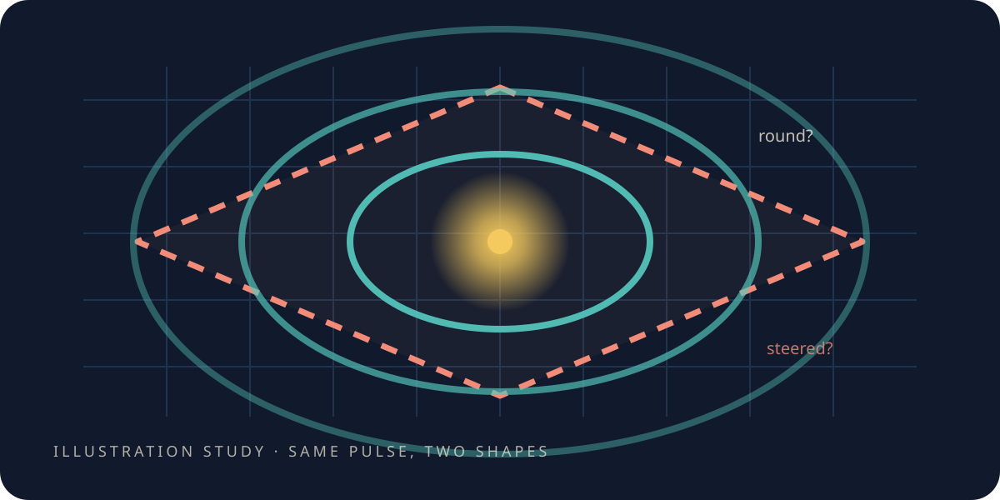

# Is it round?

> **Scope.** The ripple in this chapter is a pattern in a **toy** computation. *Light cone*, *speed*
> and *isotropy* name properties of that pattern and of fits to its output — not real light, not a
> measurement of the speed of anything, and not a claim about space.

<figure class="chapter-illustration">
  
  <figcaption><strong>Analogy — not data.</strong> Solid is what was observed; dashed is what a badly chosen sense of size does to it. The measured difference is in the figure linked below.</figcaption>
</figure>

<!-- beat 55 -->

You have the object and you have the question: poke it, and see whether the front travels at the
same speed in every direction.

Speed is a distance divided by a time. Look at what you are actually holding, and one of those two
is in your hand and the other is not.

Which half is missing?

## The half you do not have

<!-- beat 55 -->

Time you have. Ticks, all the same size, and you can count them — that is what the clock was for.

Distance you do not have. Not because it is hard to measure, but because nothing in the object has
ever been given a length. The dial exists; you met it on one tetrahedron, six lines and six
settings, and two chapters ago you turned one of them and watched the rhythm change. But nobody has
ever set it from anything real. It has been a knob with no reading on it.

So before the world can be asked how fast, somebody has to say how far.

Doesn't counting steps already do that?

## A step is not a distance

<!-- beat 56 -->

It is worth sitting with why not, because "count the lines you crossed" sounds exactly like a ruler.

Go back to how the object was built: the eight corners of a cube, sorted odd and even. Some of the
lines in the finished thing run along the edges of those cubes. Others cut across their diagonals.
And a diagonal is longer than an edge — you can see that on the cube in front of you.

But to the *counting*, both are one line. One step along an edge and one step across a diagonal are
both "one step". So a front that has crossed four lines might have gone four edges or four
diagonals, and those are not the same distance, and nothing has told the object which.

That is the dial's whole job: to say what each line is worth. Which means the answer to *is it
round* depends on a setting, and the setting has not been chosen yet.

So choose the obvious one, and guess what happens.

## ✎ Before we look

<!-- beat 57 -->

The obvious setting is to give every line the same weight. It feels like the neutral choice — the
one that assumes nothing, that plays no favourites among the lines.

**Write your guess down now** — and the useful half is not whether it comes out round. You have just
been told an edge and a diagonal differ in length and the counting cannot tell, so *not round* is
the easy call.

The live question is **which way**: along the cube's edges, or across its diagonals? One line is
enough. Commit to a direction.

This is the ritual for the rest of the book, and it is not a teaching trick. Once you have read a
number it is very hard to remember not having known it.

## The obvious setting

<!-- beat 58 -->

Set every line to the same weight and the ring comes out **lopsided**.

It runs faster across the cube's diagonals than along its edges — so if you guessed the diagonals,
you were right, and for the reason the last section gave: the counting treats a long step and a
short one alike, so the long one covers more ground per tick. What ought to be a circle is stretched
along the diagonals, and anything you aimed in this world would drift.

Notice what happened. Weighting all the lines equally *looked* like assuming nothing; it was a
strong assumption, quietly made — that an edge and a diagonal are the same length. The object never
said that. We did, by choosing the setting that felt neutral.

The number is what makes this more than a story, so here it is. Send a pulse from the middle, time
its arrival along an edge direction, time its arrival along a diagonal, and compare the two speeds.
If the ring were round they would be equal. They differ by **22.4%**.

What if the dial is set from the shape instead?

## The same dial, set from the geometry

<!-- beat 59 -->

Measure the pieces of the object and weight each line by what it actually is. Same dial, same
settings, no new machinery — a reading taken from the thing rather than assumed.

The two speeds now differ by **2.2%**: about ten times less.

Both predictions were written down before either run — that the naive setting would be *obviously*
uneven, and that the geometric one would at least halve it. That matters more than the numbers do,
and it is the step people skip.

**[Open the data-true isotropy figure](record/lab/warp-1-move/0115-lattice-matched-isotropy/figures/isotropy.html)**
— the two rings side by side, dots measured, a dashed circle for reference.

But 2.2% is not zero. What is it?

## Coarse, or broken?

<!-- beat 60 -->

A sceptic should push on the residual, and there are exactly two things it could be: the world
really is slightly uneven, or the grid is too coarse to draw a smooth circle on.

Those sound like the same complaint. They are not, and telling them apart needs no judgement.

A coarse grid gets *better* as you use bigger, gentler ripples: a long, lazy wave stops noticing the
graininess underneath it, the way a wide boat stops noticing small chop. A genuine unevenness does
nothing of the kind — it is there at every scale, because it is a property of the geometry rather
than of the resolution.

So the test writes itself. Make the ripples gentler and see whether the disagreement shrinks. Could
a machine run that test without anyone's thumb on the scale?

## Hand it to something that cannot hope

<!-- beat 61 -->

It can, and this is where the book acquires the instrument it uses for the rest of its length.

Run the sweep again in five directions at once and hand the timings to a blind fitter: a program
told nothing about what it is looking at — not the expected law, not which arm was which. It picks
from a menu written down beforehand and reports how far ahead of the runner-up it finished.

It picked the straight-line law in all five directions, and by a wide margin: its score beat the
runner-up — a square-root law — by about a quarter every time, which for a fit quality is a rout.
The speed it returned agrees across directions to within a couple of percent, and that spread
*shrinks* as the ripples get gentler. Which is the signature of a coarse grid.

**[Open the data-true fit figure](record/lab/warp-1-move/0117-dispersion-isotropy/figures/discovery.html)**
— the chosen law, the runner-up, and the gap between them, per direction.

Then the same pipeline, unchanged, on the naive setting. The spread there is **33.2%**, and it does
not shrink. Coarse and broken, told apart, by something with no opinion.

Have we ever got this wrong where anyone could see?

## The part where we were the problem

<!-- beat 62 -->

Yes, and it belongs here rather than in a footnote.

This project has a public demonstration page: a ripple going through two gaps, making the fringes
you would expect. It ran for months. It was quietly, visibly wrong — about **3.8×** brighter on one
side of the screen than the other, across that same mirror.

It looked like optics. Nobody had built any asymmetry into the scene; the two gaps were identical
and the source was centred. If you wanted to read something profound into it, the material was
there.

It was the grid, and the reason is the grain the last chapter warned about — though a different
grain, in a different place, which is why it took months to find.

## It was the grid, not the optics

<!-- beat 62 -->

Cutting a square region into triangles means choosing which way the diagonals lean. Lean them all
the same way and the mesh loses a symmetry the *experiment* has: flip the scene about the axis that
runs through the source and between the two gaps, and the scene maps onto itself — two identical
gaps, one centred source. Flip the mesh the same way and it does not. So the mesh was quietly
asserting a difference between left and right that nothing in the physics asserted, and the ripple
faithfully reported the shape of the thing it was travelling on rather than the shape of the
question.

Note what this is *not*. It is not the three-way grain of the object itself, which is a fact about
the little world and comes with a symmetry that carries each kind of place onto the others. This was
a two-dimensional drawing choice in one demo, and it broke a mirror the experiment depended on.

## The fix, and the switch still on the page

<!-- beat 62 -->

The fix is embarrassing in its simplicity: alternate the diagonals, so mirroring the mesh maps it
onto itself. Same scene, same solver, same everything else. The asymmetry drops to about fifteen
decimal places down, which is another way of saying *exactly*, as far as the machine can tell.

**[Open the data-true mesh-repair figure](record/lab/warp-3-shield/0305-doubleslit-mirror/figures/doubleslit_mirror.html)**
· **[open the demo and turn it on and off yourself](record/viz/doubleslit.html)**

That last link is the one worth clicking. It carries a switch between the two meshes, so you can
watch a real defect of ours appear and disappear. The switch is still in it, on the public page.

So what did the chapter settle?

## What this chapter settled

<!-- beat 63 -->

Not that the little world has light in it. It does not.

Two things, both of which everything after this depends on.
**One setting decides whether the world behaves the same way in every direction** — and that setting
is a choice somebody makes, not a fact the object hands over. And
**we can tell a coarse grid from a broken geometry**, by whether the disagreement shrinks when the
ripples get gentler.

Go and look at your guess now. Whichever way it went, you know something about the dial that you
could not have known by being told.

A world that steers untrue is a world where no measurement means what it appears to mean. This one
steers true enough to push on — so push on it.

*What this chapter cites — and what it does not:
[the simulations](the-simulations.md#s-the-round-ripple).*

**Next:** [What does pushing on it cost?](the-bubble-and-its-bill.md)—move a piece of the world,
contents and all, and read the bill.