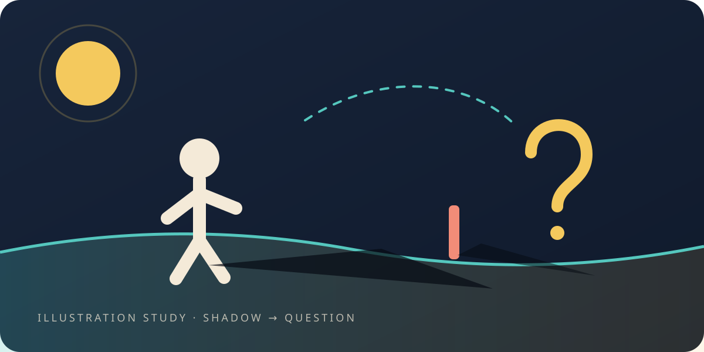

# The shadow

> **Scope.** This is a book about a **toy**: a small world built inside a computer, and what happened
> when we pointed real tests at it. Nothing here is a claim about nature. Where a chapter uses a word
> like *vacuum* or *light cone*, the word names a pattern in the model.

<figure class="chapter-illustration">
  
  <figcaption><strong>Analogy — not data.</strong> A shadow is not evidence of its source — it is an invitation to build a test. That move, not the shadow, is what this book is about.</figcaption>
</figure>

A child notices that her shadow is short at noon and long in the evening. She has just made a
measurement. She does not know it yet, and nothing about the shadow tells her what to do next.

<!-- NOTE(zac): too fast — we can spend some time here as the first example.  Plus He was great for his position already.  this was a sideshow trick.   -->
Somebody once did know what to do next, and his name was Eratosthenes of Cyrene. Around 240 BCE he had
heard that at midsummer noon in Syene, far to the south, a vertical post cast no shadow at all —
sunlight fell straight down a well and lit the water. In Alexandria on the same day, a post *did* cast
a shadow, a short one. Two posts, both upright, both at noon. One shadow, one none.

If the world were flat, that could not happen. Upright posts on a flat world under a distant sun cast
the same shadow everywhere. So he did the thing this whole book is about: he took a small, ordinary
observation and turned it into a shape the world would have to have. A curve. And then — this is the
part that matters — he turned the shape into a **number**, because a shape you can measure is a shape
that can be wrong. He measured the angle of the short shadow, paced out the distance between the two
towns, and got a size for the Earth.

He was close. That is not the interesting part.
<!-- NOTE(zac): I feel like we have better examples of this story and writeup  -->
## The interesting part is the order he did things in

Notice what he did *not* do. He did not begin with a beautiful idea about spheres and then hunt for
shadows that fitted it. He began with a discrepancy he could not explain, proposed the smallest shape
that would explain it, and then committed to a number — a number that could have come out absurd, and
would have taken his shape down with it.

That order is the whole method:

1. Notice something you cannot explain.
2. Propose the smallest structure that would explain it.
3. Say, in advance, what result would prove the proposal wrong.
4. Check. Keep the answer, especially when it is no.

Step three is the one people skip. It is uncomfortable, it slows everything down, and it is the only
step that makes the other three worth anything. Without it you have a story that fits — and stories
that fit are cheap, because you can always find one after you know the answer.

## What we are doing here
<!-- NOTE(zac): Lets not make it unobtainable.  the whole story is this is super easy. -->
We built a small world inside a computer. Not a model of this world — a world of its own, with the
fewest parts we could manage: places to hold numbers, connections between them, and one rule for how
a number changes when its neighbours do.

Then we pointed questions at it. Does a ripple spread evenly? What does it cost to push a region of
it around? Can we empty a patch of it out? What happens between two walls? Can it tell us a number
nobody told it?

For each question we wrote down, first, what we expected and what would count as failure. Then we
ran it. Some answers came back yes. Some came back no. One came back yes for months and turned out to
be an artefact of how we had drawn the grid — and finding that is in here too, because a book that
only reports the yeses is not reporting.

**Everything here can be looked up.** Every chapter tells you what was expected before the run, and
every chapter's last line points at the files where the run lives: the question as it was registered,
the test that re-runs it, the figure drawn from its own output. The final chapter is about going and
looking.
<!-- NOTE(zac): we don't need to sell honesty or integrity now.  this distracts.  it's necessary, just not here.  this same theme is a bit oversold throughout -->
## A warning about the word "bubble"

This edition is called *Our Bubble*, and the word does no work beyond two ordinary meanings. Inside
the model, a *bubble* is a bounded region — a patch of the little world that we push on and measure.
Outside it, the bubble is the shared view you and I have while we look at the same experiment
together.
<!-- NOTE(zac): pronouns hurt when talking about things - 'it' has a name - "outside the model, the bubble" is this necessary to mention now? -->

It is **not** a claim about the shape of the cosmos, not a proposal that this lattice is space, and
not a suggestion that any number here is a constant of nature. This project once flirted with that
kind of talk, and it does not any more. The list of retired claims is one of the things this book
checks itself against when it is built.
<!-- NOTE(zac): this feels like apologizing for something we're not doing now.  our code is our defense, not our posture.  -->
 
So: a shadow is not proof of a sphere. It is an invitation to go and measure one. Let us go and
measure.
<!-- NOTE(zac): that exit feels too quick -->

*What this chapter cites — and what it does not: [the simulations](the-simulations.md#s-the-shadow).*

**Next:** [A few thousand years of sharper shadows](a-few-thousand-years-of-sharper-shadows.md)—the
same method, and the two thousand years it took for the instruments to catch up with it.
