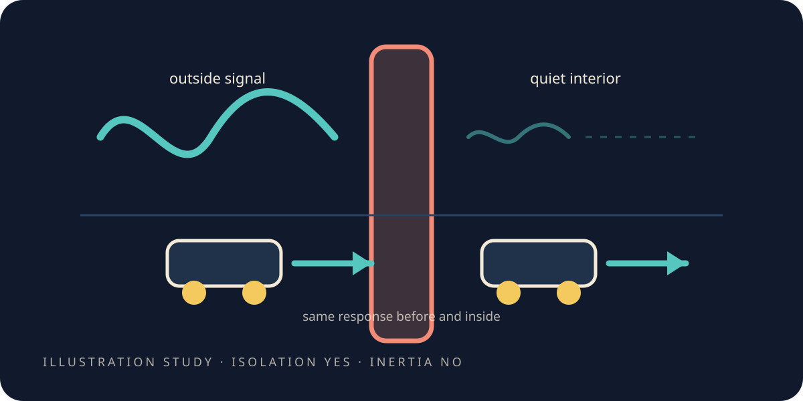

# Can you wall a piece off?

> **Scope.** A **toy** computation. The "wall" is a region of the lattice we made hard for a signal to
> cross; "inertia" is how far a test blob moves under the same push. Nothing here is a shield, a
> device, or a claim about mass.

<figure class="chapter-illustration">
  
  <figcaption><strong>Analogy — not data.</strong> One experiment, two answers: the isolation worked, and the effect people wanted from it did not.</figcaption>
</figure>

<!-- beat the-wall-that-worked-and-didnt.1 -->

The last chapter stopped at a barrier. A shaped push wants something below the floor; ordinary
fields never go below the floor. So stop asking the fields, and look at the other half of the
problem.

A push has two halves: what you spend, and what you are pushing against. We have been staring at the
first. Is the second softer than it looks?

Here is the idea that says it might be, and it deserves to be taken seriously enough to break.

Ask what a thing's resistance to being pushed actually *is*. The obvious answer is that it is a
private property — a number the thing carries around, the way it carries a colour. Ernst Mach argued
in the nineteenth century for something quite different: that the resistance is a *relationship*
between the thing and everything else there is. Einstein, who named the idea after him, took it
seriously enough to try to build it into his theory of gravity.

If that were right, a thing cut off from everything else should get easier to push. And we happen to
have a world we can cut a region off inside.

## ✎ Before we look

<!-- beat the-wall-that-worked-and-didnt.2 -->

**Write your guess down.** Build a shell in the little world that a signal cannot cross, put a test
blob inside it, and shove the blob. Does it move further than it would have without the shell?

Two more things worth committing to while you are at it, because they turn out to be separate
questions and the chapter's whole shape is that they got separate answers. Do you expect the shell
to isolate at all? And if the blob does move differently, by how much — a little, or a lot?

## First question: does the wall isolate?

<!-- beat the-wall-that-worked-and-didnt.3 -->

It does, and convincingly.

Build the shell — a region where the field is heavily suppressed. It is not the bubble wall of the
last chapter; that was a shape the energy took, and this is a thing we put there on purpose. Then
send a signal from outside and see how much of it arrives inside.

About **half a million times** weaker than it would have been without the shell. That is not a
marginal effect. The interior genuinely does not know what is going on outside.

**[Open the data-true shield figure](record/lab/warp-3-shield/0300-shield-imbalance-inertia/figures/shield.html)**

Which should immediately make you suspicious of something.

## How do I know it is a shield and not a sponge?

<!-- beat the-wall-that-worked-and-didnt.4 -->

That is the right question, and it is the reason the run has a control in it.

A shell that suppresses everything inside would look identical to a shell that suppresses everything
everywhere. If we had accidentally built a machine that damps all signals equally, the isolation
figure would still have come back enormous, and it would have meant nothing at all.

So the same run also measured a path that goes from outside to outside, never crossing the shell. If
the shell is a genuine local barrier, that path should be barely touched.

It comes through at about **0.86** of its unobstructed strength. Slightly attenuated, essentially
intact. So what we have is a real, local, measured imbalance — the inside cut off, the outside left
alone.

Now the question the chapter was built for. The blob inside: does it move differently?

## Second question: no, and not marginally

<!-- beat the-wall-that-worked-and-didnt.5 -->

The blob inside moves exactly as far as it did before.

Not slightly further. Not slightly less. The blob's displacement differs between the walled and
unwalled cases by about a millionth — far inside the threshold registered for it. The run does not
claim the two cases are bit-for-bit identical, and says why: the wall reflects a wave of its own
that leaks back inward at lattice speed. That is a difference in what reaches the blob, and it is
not a difference in how hard the blob is to push.

Go and look at your guess. This is the one the ritual is for, because the idea in the opening is
genuinely attractive, and half the point of writing a prediction down is to catch yourself having
found an attractive idea plausible.

Why nothing at all, though? Not "why was the effect small" — why was it *absent*?

## Where a wall lives in the equations

<!-- beat the-wall-that-worked-and-didnt.6 -->

Because of where a wall of this kind enters the machinery, and once you look it is not subtle.

It enters as a *potential*: something that pushes back at its own location. It appears in the
equations exactly where the shell is, and it contributes precisely nothing at the position of the
blob in the middle. There is no term there for it to change. The blob is not being told about the
wall, because the wall is not in the blob's arithmetic.

If anything, the wall region itself became *harder* to move rather than easier. The suppression
makes the shell more sluggish — the opposite of the hoped-for direction, and exactly what you would
expect from a potential rather than from a change in what resistance means.

So what is that no actually worth?

## What the no is worth

<!-- beat the-wall-that-worked-and-didnt.7 -->

Notice first what it does not say. It does not say the coupling idea is wrong.

It says something narrower and more useful:
**under standard physics, cutting off the information does not cut the resistance**, because
resistance and potentials live in different places in the equations. To get the effect you would
need an extra law — a new rule tying mass to environmental coupling — and that rule is a separate,
contested hypothesis, which this experiment does not assume.

That is a bound rather than a shrug: a null stated with its size, which is what took Aristarchus'
successors [two thousand years](a-few-thousand-years-of-sharper-shadows.md) to learn.

And the run even priced the interesting version for us: *if*
such a law existed, this shell's isolation figure would predict a spectacularly lighter interior. It
does not, so it does not.

There is one more route to the same barrier, and it is worth closing before moving on.

## Can aimed fields empty a volume?

<!-- beat the-wall-that-worked-and-didnt.8 -->

Shielding a region isolates it. It does not *empty* it. So try the other thing: arrange ordinary
fields, several sources carefully aimed, so they cancel one another over a whole volume.

Note how modest that would be even if it worked: cancelling reaches zero, and a shaped push wants
below the floor.

A conjecture, with a threshold: the target volume had to hold less than a fifth of the field
elsewhere. It never came close. Tested to destruction. **No.**

The energies add. You can cancel a field at a point and on a surface, but a volume where everything
is zero cannot be built out of sources aimed from outside — the reason is structural, not a matter
of trying harder.

**[Open the data-true null figure](record/lab/warp-3-shield/0304-four-source-null/figures/null.html)**

Two chapters, three noes, and the barrier from
[what pushing on it costs](the-bubble-and-its-bill.md) still standing. This is the point in a
project where you either stop, or you go and find the one place the sign is genuinely allowed.

There is one. It is not in the fields at all — it is in what is left when you take them away.

*What this chapter cites — and what it does not:
[the simulations](the-simulations.md#s-the-wall-that-worked-and-didnt).*

**Next:** [Can a gap be emptier than empty?](where-negative-energy-appears.md)—the one place the
sign is real, and what it costs to get there.