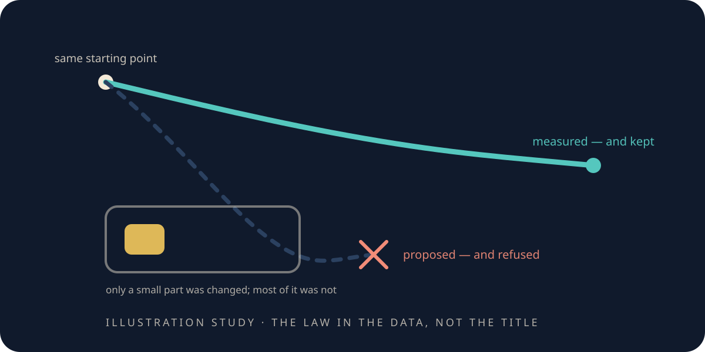

# When the world you built says no

> **Scope.** *Cavity*, *resonance*, *material weight* and *exponent* name geometry and numbers inside a
> lattice **toy**. No real substance is being modelled and no real frequency is being measured; the
> record's own name for this experiment, and what it was originally a bridge toward, are in the
> appendix. This chapter is about a prediction that came out wrong.

<figure class="chapter-illustration">
  
  <figcaption><strong>Analogy — not data.</strong> The steep line was the guess and it was refused; the gentle line was the measurement and it was kept. The exponent that decides it is in the figure linked below.</figcaption>
</figure>

<!-- beat 98 -->

The instrument has now agreed with everything it was pointed at. That is the problem.

So ask the sharpest version of the question: what is the simplest kind of prediction to get wrong?

Not a hard one. A hard prediction being wrong teaches you very little — you were guessing. The
dangerous kind is **a law you are sure of**: something so standard that nobody would think to check
it, applied one step outside where it was learned. If an instrument cannot refuse one of those, its
agreements are worth nothing, because it would have agreed anyway.

Here is one.

## A lump in a cavity

<!-- beat 99 -->

Put a small region inside a resonating cavity and make it harder for the field to move through — a
lump of denser material, in effect.

The resonance drops in frequency. That much is not in question, and the experiment shows it plainly:
put the weighted region near the side of the cavity being shaken, sweep the shaking rate, find the
pitch it answers loudest at. As the region gets denser the peak moves down, smoothly and repeatably.
There is no ambiguity about whether there is an effect, or about its direction.

The question is *by how much*, as the lump is made denser. Which is a law, and laws can be refused.

## ✎ Before we look

<!-- beat 100 -->

Here is the argument everybody reaches for, and it is a good one.

If you filled the **whole** cavity with the denser material, the frequency would fall like a square
root: quadruple the material weight and the frequency halves. That is standard, and it is not in
doubt. So putting *some* of that material in should do the same thing, only less of it. The scaling
should still be a square root.

**Write down your guess.** Does a partial lump obey the whole-cavity law?

We registered ours before running, and it was the obvious one: the exponent should come out at
**p = −1/2**. Written down, committed, with the run still ahead of it.

## What came back

<!-- beat 101 -->

We handed the peak positions and the weights to a fitter and asked it for one thing: the power the
pitch follows as the lump gets denser. No menu this time, and no runner-up — one law, fitted, with
the exponent left free to come out wherever the data put it. Which is all this beat needs, because
the number we had committed to was a specific one.

It came back with **p = −0.2753**, at a fit quality of **R² = 0.9774**.

The expectation was −1/2. The measurement is a little over half that steep — a gap of about 0.22,
against a threshold of 0.10 registered before the run to decide exactly this. And it is not an
artefact of one fitting choice: refit it a different way and the exponent moves to −0.3247, still
nowhere near −1/2. **The law we proposed is the wrong law for this geometry, and it is refused.**

**[Open the data-true shift-law figure](record/lab/dna-thz/0001-dna-permittivity-shift-law/figures/shift_law.html)**

Go and look at your guess. If you wrote *square root*, you are in good company — so did we, in
writing, in advance.

## Why — and what the reason is worth

<!-- beat 102 -->

The square-root argument assumes the material weight governs the whole resonating volume. Here it
does not: the lump is a small part of the cavity and most of the vibration sits in unchanged space.
A local change should not inherit the scaling of a global one — so the mistake was in the argument
rather than in the run.

That explanation is comfortable, which is exactly when to be careful. A comfortable explanation
arrives after the answer and costs nothing, and there is no way to tell a good one from a
face-saving one except by making it pay.

So it is written down where the next experiments queue up: if the volume fraction is really the
reason, giving the lump a bigger share of the cavity should move the exponent toward −1/2. Testable,
and named on the record as the thing to do next.

Be exact about its standing, though, because the chapter's own point applies to us.
**It is not yet a prediction.** Nothing is registered and nothing is run — no spec, no gate. Until
there is, it is an explanation that has not paid: better than an excuse, and less than a commitment.

## What a refusal is worth

<!-- beat 103 -->

The same *kind* of instrument — a fitter told nothing — found the ripple's law, the vacuum's
coefficient and the class numbers. Here it refused the most natural material-scaling analogy anyone
would have reached for. Not the same code each time: the ripple's fitter picks from a menu, the
vacuum's is bespoke to its own gate, this one fits a single free exponent. The same discipline every
time: no answer supplied.

It returned the law that was in the data rather than the law in the chapter title.

Which is what makes the agreements mean something. An instrument that only ever agrees has told you
about itself. This one has now disagreed with its owners, in public, on a point they had committed
to in writing — so when it agrees, the agreement is information.

That is what the four steps in [the shadow](the-shadow.md) were for.

We have followed the chain from an object, through a ripple, a cost, a wall, a vacuum, a prediction,
and a refusal. One step is left, and it does not belong to us.

*What this chapter cites — and what it does not:
[the simulations](the-simulations.md#s-when-the-expected-law-fails).*

**Next:** [A few thousand years of sharper shadows](a-few-thousand-years-of-sharper-shadows.md)—two
thousand years of the same method, and what our own two failures turned out to be.