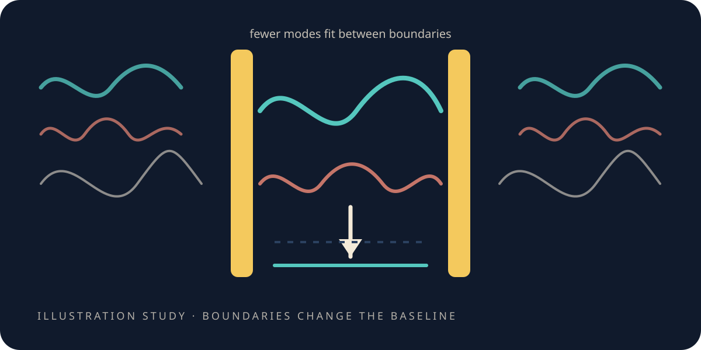

# Where negative energy appears

> **Scope.** A **toy** computation of a Casimir-like effect. The negative value is a difference between
> two baselines inside that computation — not a reservoir of usable energy, and not evidence that
> anything can be built. *Vacuum* here names the lowest state of a discrete model.

<figure class="chapter-illustration">
  
  <figcaption><strong>Analogy — not data.</strong> Fewer shapes fit inside than outside, so the baseline between the plates differs from the baseline beyond them. What the difference actually measures is in the figure linked below.</figcaption>
</figure>

Two chapters have now run into the same barrier from three directions. A shaped push wants energy
below the floor. Ordinary fields cannot go below the floor. Shielding does not change what inertia is,
and interference cannot empty a volume.

But established physics does have a place where a negative *difference* is real, and it is not in the
fields at all. It is in what is left when you take the fields away — an effect Hendrik Casimir worked
out in 1948, and which has since been measured in the laboratory.

## Empty does not mean featureless

In quantum theory, a field does not sit perfectly still even in its lowest state. Every shape it could
vibrate in carries a little irreducible activity, and the total over all those shapes is the baseline
of empty space.

Now put two walls close together.

Some shapes no longer fit. A vibration whose natural length is wider than the gap simply cannot exist
in there, the way a long wavelength cannot exist on a short guitar string. The set of available shapes
between the walls is smaller than the set available outside them.

So the baseline inside is not the baseline outside. And since we removed contributions rather than
adding them, the inside sits *lower*.

That is the whole mechanism, and it is worth noticing how little it needs. No exotic material, no new
law — just boundaries, and the ordinary fact that boundaries exclude possibilities.

## What the little world did with it

We built the one-dimensional version. Two walls in the lattice, the allowed vibration shapes computed
directly from the object's own operator, the common bulk contribution subtracted off, and then the
question: what is left?

Every measured value sits below the free-space line. And as the walls move closer, it goes further
down — which is the same thing as saying the walls are pulled together, since a quantity that drops as
a gap narrows is a quantity that would rather the gap narrowed.

That is the sign three attempts had been unable to reach, appearing on its own.

## The part that makes it more than a sign

A sign is easy. Half the ways of getting this calculation wrong give you a negative number.

What is harder — and what this experiment was really for — is the *shape* of the answer. Casimir's calculation gives a
law for how the effect scales with the gap, and it comes with a specific coefficient that has a π in
it. If our little world reproduces the scaling *and* lands on the coefficient, then we are not
looking at a sign, we are looking at the phenomenon.

So we swept the gap over a range of separations and handed the results to the same blind fitter from
[the round ripple](the-round-ripple.md).

It came back with the scaling law: the exponent it found was **−0.9997** against a true value of −1,
with a fit quality of six nines. It separated out the contribution from the two wall edges and got
essentially exactly the right value for that too. And it returned a coefficient of **−0.13099** where
the exact answer is **−π/24 = −0.13090** — a match to **0.07%**.

Nobody typed π into the fitter. Nobody typed the exponent in. It was not told what to look for.

**[Open the data-true Casimir figure](record/lab/warp-4-vacuum/0400-casimir-negative-energy/figures/casimir.html)**

## Two things this does not mean

**It is not a power source.** The negative number is a difference between two baselines. You cannot
draw on it; there is nothing to draw. Arranging boundaries costs more than the difference is worth,
and in any case there is no energy in this chapter at all — there is a lattice, a spectrum, and a
subtraction.

**It does not rescue the shaped push.** That experiment wants a particular amount of the sign, in
a particular place, at a particular scale. What we found here is the sign, in a tiny gap, at a
magnitude set by the gap itself. The distance between those two facts is enormous and this chapter does
not shrink it by a step. What it does is establish that the sign is not forbidden — which is a much smaller
thing than a solution.

## What actually changed here

Something quieter than the physics.

Up to this chapter, a person set up each experiment, ran it, and read off the answer. Here the
*machine* swept a parameter, fitted the results, chose between candidate laws, and reported a
coefficient — and a person only checked that it had done so.

That is a different kind of instrument. And once you have an instrument that can find a law it was not
told, you can point it at something where nobody knows the answer.

Which is the next chapter.

*The simulations behind this chapter: [the simulations](the-simulations.md#s-where-negative-energy-appears).*

**Next:** [A number without the answer key](a-number-without-the-answer-key.md)—can it find
something nobody told it?
